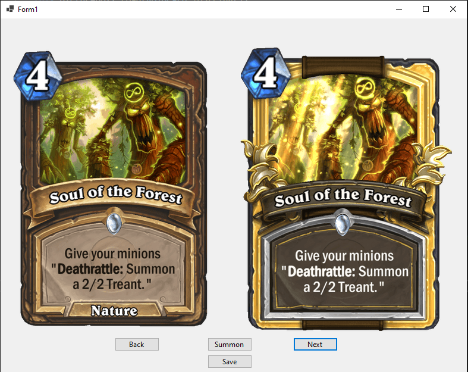

Proiectul foloseste acest api (https://rapidapi.com/omgvamp/api/hearthstone?endpoint=5525c47de4b0b69ffe83f7bd) prin care afișează carți din jocul HearthStone.

Putem schimba carțile cu două butoane "Next" și "Back" dar și să salvăm cartea (path-ul de la save este pus pentru PC-ul meu, se poate modifica în funcția button4_Click, aveți grijă să fie setat într-un fișier cu permisiune write).

